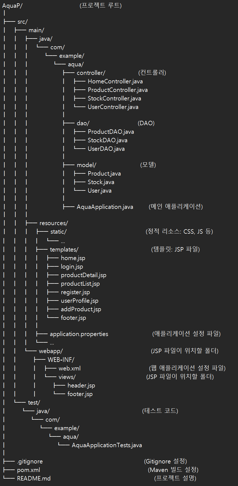

# AquaP - 수족관 쇼핑몰 프로젝트

## 소개
AquaP는 수족관 관련 상품을 판매하는 쇼핑몰 애플리케이션입니다.  
회원가입, 로그인, 상품 목록 보기, 상품 상세 정보 확인, 상품 재고 확인 등의 기능을 제공합니다.

---

## 주요 기능
- **홈 화면**
  - 상품 및 서비스 소개
- **회원 관리**
  - 회원가입 및 로그인
- **상품 관리**
  - 상품 목록 확인
  - 상품 상세 정보 확인
  - 재고 상태 확인

---

## 프로젝트 구조
AquaP/                          (프로젝트 루트)
│
├── src/
│   ├── main/
│   │   ├── java/
│   │   │   └── com/
│   │   │       └── example/
│   │   │           └── aqua/
│   │   │               ├── controller/               (컨트롤러)
│   │   │               │   ├── HomeController.java
│   │   │               │   ├── ProductController.java
│   │   │               │   ├── StockController.java
│   │   │               │   └── UserController.java
│   │   │               │
│   │   │               ├── dao/                      (DAO)
│   │   │               │   ├── ProductDAO.java
│   │   │               │   ├── StockDAO.java
│   │   │               │   └── UserDAO.java
│   │   │               │
│   │   │               ├── model/                    (모델)
│   │   │               │   ├── Product.java
│   │   │               │   ├── Stock.java
│   │   │               │   └── User.java
│   │   │               │
│   │   │               ├── AquaApplication.java       (메인 애플리케이션)
│   │   │
│   │   ├── resources/
│   │   │   ├── static/                                    (정적 리소스: CSS, JS 등)
│   │   │   │   └── ...
│   │   │   ├── templates/                                 (템플릿: JSP 파일)
│   │   │   │   ├── home.jsp
│   │   │   │   ├── login.jsp
│   │   │   │   ├── productDetail.jsp
│   │   │   │   ├── productList.jsp
│   │   │   │   ├── register.jsp
│   │   │   │   ├── userProfile.jsp
│   │   │   │   ├── addProduct.jsp
│   │   │   │   └── footer.jsp
│   │   │   │
│   │   │   ├── application.properties                    (애플리케이션 설정 파일)
│   │   │   └── ...
│   │   └── webapp/                                        (JSP 파일이 위치할 폴더)
│   │       ├── WEB-INF/
│   │       │   ├── web.xml                               (웹 애플리케이션 설정 파일)
│   │       │   └── views/                                (JSP 파일이 위치할 폴더)
│   │       │       ├── header.jsp
│   │       │       └── footer.jsp
│   └── test/
│       └── java/                                          (테스트 코드)
│           └── com/
│               └── example/
│                   └── aqua/
│                       └── AquaApplicationTests.java
│
├── .gitignore                                              (Gitignore 설정)
├── pom.xml                                                 (Maven 빌드 설정)
└── README.md                                               (프로젝트 설명)





---

## 사용 기술
- **Java 11**
- **Spring Boot 3.3.3**
- **H2 Database**
- **Apache Tomcat 9**
- **JSP & JSTL**

---

## 실행 방법
1. 프로젝트를 클론:
   ```bash
   git clone https://github.com/kwon2501/AquaP.git

2. 프로젝트 루트로 이동:
cd AquaP

3. Maven 빌드 및 실행 :
   mvn spring-boot:run
4. 웹브라우저 : http://localhost:8080


---

완료 끝!!
